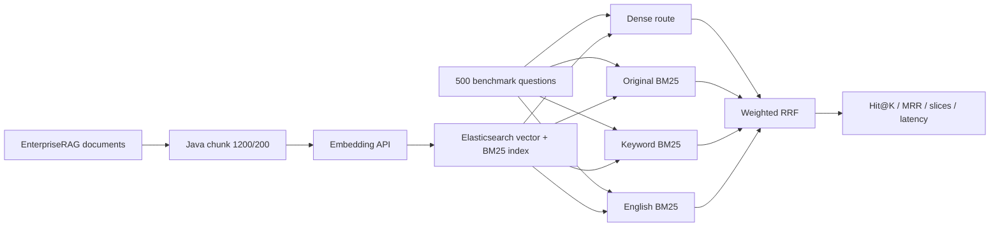

# PaiSmart EnterpriseRAG Java Benchmark

一个可独立运行的 Java 17 企业 RAG 检索项目：下载并转换 EnterpriseRAG-Bench，
分块后调用真实 Embedding，写入隔离的 Elasticsearch 索引，再用固定 500 题评测
Dense、BM25 和四路 Hybrid。它不依赖 PaiSmart 原应用、MySQL、Redis 或 Spring。

> 这里的 `Hit@10=98.09%` 表示 470 道可评测问题中，标准文档进入 Top10 的比例，
> 不是最终回答 98.09% 正确，更不是 100% 准确率。

## 已验证结果

固定条件：10,722 篇文档、115,406 个 Chunk、500 题（470 题有 gold 文档）、
1,200 字符 Chunk、200 字符 overlap、Elasticsearch 8.10.4。

| Java 方案 | Hit@1 | Hit@10 | MRR@10 | 平均延迟 |
|---|---:|---:|---:|---:|
| 早期通用 Hybrid + Top50 全局 rerank | 68.51% | 86.81% | 0.7493 | 213.54 ms |
| E5 + source/ACL + tuned weighted Hybrid | 86.81% | 96.60% | 0.9046 | 85.04 ms |
| Qwen3-Embedding-4B Dense | 83.83% | 95.96% | 0.8808 | 84.85 ms |
| **Qwen3-Embedding-4B 四路 Hybrid** | **89.15%** | **98.09%** | **0.9217** | **255.44 ms** |
| 百炼 text-embedding-v4 四路 Hybrid | 88.94% | 97.45% | 0.9194 | 581.53 ms |

四路是：Dense、原始问题 BM25、去停用词关键词 BM25、English analyzer BM25，
最后用加权 RRF 融合。完整过程见 [实验记录](docs/EXPERIMENT_LOG.md)，原始 summary
在 [`results/`](results/) 中。整理后的独立 Jar 已在 A40 重跑 500 题，Hit/MRR 与迁移前
完全一致，见 [验证记录](docs/VALIDATION.md)。

## 流程



## 仓库内容

```text
src/main/java/.../benchmark/   建索引、断点导入、检索评测 CLI
src/main/java/.../service/     BM25 query rewrite、weighted RRF
src/test/                      单元测试
data/sample/                   可公开的三文档 smoke 数据
tools/                         EnterpriseRAG-Bench 下载转换脚本
config/                        已验证的 2048 维 ES mapping 快照
results/                       六次固定 500 题实验 summary
docs/                          架构、数据协议、实验与面试说明
```

## 1. 构建

```bash
mvn clean verify
java -jar target/paismart-enterprise-rag.jar --help
```

要求：JDK 17、Maven 3.9、Elasticsearch 8.x，以及一个 OpenAI 兼容或
DashScope 原生 Embedding 服务。本项目不要求、也不提供本地 Docker。

## 2. 启动本地模型服务

已验证配置是在 A40 的 vLLM 环境部署 Qwen3-Embedding-4B：

```bash
conda activate vllm
vllm serve /opt/models/Qwen3-Embedding-4B \
  --task embed \
  --served-model-name Qwen/Qwen3-Embedding-4B \
  --host 0.0.0.0 \
  --port 18084 \
  --max-model-len 8192
```

服务应提供 `POST /v1/embeddings`，返回 2048 维 float 向量。

## 3. 用 sample 跑完整链路

先创建独立索引。命令不会删除或重建已有索引：

```bash
java -jar target/paismart-enterprise-rag.jar create-index \
  --es-url http://127.0.0.1:19200 \
  --index paismart_enterpriserag_sample_v1 \
  --embedding-model Qwen/Qwen3-Embedding-4B \
  --embedding-dimension 2048
```

导入三篇 sample 文档：

```bash
java -jar target/paismart-enterprise-rag.jar import \
  --docs data/sample/docs.jsonl \
  --acl-docs data/sample/acl_docs.jsonl \
  --es-url http://127.0.0.1:19200 \
  --index paismart_enterpriserag_sample_v1 \
  --embedding-url http://127.0.0.1:18084/v1/embeddings \
  --embedding-api-format local \
  --embedding-model Qwen/Qwen3-Embedding-4B \
  --embedding-dimension 2048 \
  --checkpoint runs/sample-import-checkpoint.json
```

执行四路 Hybrid：

```bash
java -jar target/paismart-enterprise-rag.jar evaluate \
  --questions data/sample/questions.json \
  --output runs/sample-summary.json \
  --details-output runs/sample-details.jsonl \
  --es-url http://127.0.0.1:19200 \
  --index paismart_enterpriserag_sample_v1 \
  --embedding-url http://127.0.0.1:18084/v1/embeddings \
  --embedding-api-format local \
  --embedding-model Qwen/Qwen3-Embedding-4B \
  --embedding-dimension 2048 \
  --embedding-query-instruction "Given an enterprise search query, retrieve relevant passages that answer the query" \
  --retrieval-mode hybrid \
  --retriever-k 50 \
  --dense-chunk-candidates 500 \
  --dense-num-candidates 2500 \
  --rrf-k 10 \
  --dense-weight 0.75 \
  --bm25-weight 0.50 \
  --keyword-bm25-enabled true \
  --keyword-bm25-weight 1.25 \
  --english-bm25-enabled true \
  --english-bm25-weight 1.50 \
  --top-k 50
```

## 4. 准备固定 500 题

大数据不提交 Git。转换脚本默认导出 10,000 篇干扰文档，并强制加入 500 题所需的
gold 文档；本次实验最终得到 10,722 篇、约 117 MiB 的输入文件。

```bash
python -m venv .venv-data
source .venv-data/bin/activate
pip install -r tools/requirements-data.txt
python tools/prepare_enterpriserag_bench.py \
  --out-dir data/enterpriserag \
  --limit-docs 10000
```

随后把 sample 命令中的三条数据路径换成 `data/enterpriserag/`。全量 Qwen3 导入
会生成 115,406 个 2048 维向量，必须使用新的 2048 维索引，并保留 checkpoint。

## 5. 分开做消融实验

只改检索模式，其他参数保持固定：

```bash
# Dense only
java -jar target/paismart-enterprise-rag.jar evaluate ... --retrieval-mode dense

# BM25 only，不调用 Embedding 服务
java -jar target/paismart-enterprise-rag.jar evaluate ... --retrieval-mode bm25

# Dense + 原始 BM25
java -jar target/paismart-enterprise-rag.jar evaluate ... --retrieval-mode hybrid
```

最终四路还需开启 `keyword-bm25-enabled` 和 `english-bm25-enabled`。全量参数与结果
见 [复现说明](docs/REPRODUCIBILITY.md)。

## 安全边界

- 数据、模型、API Key、ES 索引均不提交 Git。
- 云端 Key 通过 `DASHSCOPE_API_KEY` 环境变量注入，不写配置和实验结果。
- Benchmark 的 `source_types` 被用作可见数据源范围；生产系统必须改为登录用户真实
  ACL，不能把题目标签当权限。
- `create-index` 遇到同名索引默认失败，不会隐式删除业务数据。
- Apache-2.0 只覆盖本仓库代码；外部数据和模型遵循各自许可。

## 文档

- [架构与代码入口](docs/ARCHITECTURE.md)
- [数据格式](docs/DATA_FORMAT.md)
- [完整实验记录](docs/EXPERIMENT_LOG.md)
- [复现与指标口径](docs/REPRODUCIBILITY.md)
- [验证记录](docs/VALIDATION.md)
- [面试讲法](docs/INTERVIEW_GUIDE.md)
