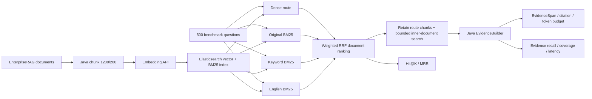

# PaiSmart EnterpriseRAG Java Benchmark

一个可独立运行的 Java 17 企业 RAG 项目：下载并转换 EnterpriseRAG-Bench，分块后调用
真实 Embedding，写入隔离的 Elasticsearch 索引，再评测 Dense、BM25、四路 Hybrid
以及文档内部 Evidence 选择。它不依赖 PaiSmart 原应用、MySQL、Redis 或 Spring。

> 这里的 `Hit@10=98.09%` 表示 470 道可评测问题中，标准文档进入 Top10 的比例，
> 不是最终回答 98.09% 正确，更不是 100% 准确率。

## 已验证结果

固定条件：10,722 篇文档、115,406 个 Chunk、500 题（470 题有 gold 文档）、
1,200 字符 Chunk、200 字符 overlap、Elasticsearch 8.10.4。

| Java 方案 | Hit@1 | Hit@10 | MRR@10 | 平均延迟 |
|---|---:|---:|---:|---:|
| 早期通用 Hybrid + Top50 全局 rerank | 68.51% | 86.81% | 0.7493 | 213.54 ms |
| E5 + source/ACL + tuned weighted Hybrid | 86.81% | 96.60% | 0.9046 | 85.04 ms |
| Qwen3-Embedding-4B Dense | 83.83% | 95.96% | 0.8808 | 84.85 ms |
| **Qwen3-Embedding-4B 四路 Hybrid** | **89.15%** | **98.09%** | **0.9217** | **255.44 ms** |
| 百炼 text-embedding-v4 四路 Hybrid | 88.94% | 97.45% | 0.9194 | 581.53 ms |

四路是：Dense、原始问题 BM25、去停用词关键词 BM25、English analyzer BM25，
最后用加权 RRF 融合。完整过程见 [实验记录](docs/EXPERIMENT_LOG.md)，原始 summary
在 [`results/`](results/) 中。整理后的独立 Jar 已在 A40 重跑 500 题，Hit/MRR 与迁移前
完全一致，见 [验证记录](docs/VALIDATION.md)。

当前新增了两层能力：

- **P0 可复现运行**：一个版本化 `ExperimentConfig` 驱动完整评测，并生成包含代码提交、
  最终参数、输入 SHA-256、索引 mapping 元数据和运行状态的 `RunManifest`。
- **P1 Java EvidenceBuilder**：保持文档排名不变，保留四条路线命中的代表 Chunk，再对
  Top 文档做有界的文档内检索，按互补性和 Token 预算输出 Chunk 级引用。

P0/P1 已在 A40 完成固定 500 题验收。六项已报告缺陷均先在修复前提交复现，再验证对应
修复，结果为 `6/6`。Java EvidenceBuilder 保持500题 Top50 文档排名逐题不变，ACL越界为0；
同口径 Context fact recall 从71.99%提高到73.24%，但平均 Prompt 增加约39%，固定
Qwen2.5 Generator 的答案指标略降，DeepEval Correctness 为 `0.496 -> 0.494`。
因此 P0 接受，P1 保留为可选实验链路，当前6000 Token配置不设为默认。完整记录见
[`docs/A40_P0_P1_VALIDATION_2026-09-03.md`](docs/A40_P0_P1_VALIDATION_2026-09-03.md)。

## 流程



## 仓库内容

```text
src/main/java/.../benchmark/   建索引、断点导入、ExperimentConfig、RunManifest、评测 CLI
src/main/java/.../service/     BM25 rewrite、weighted RRF、EvidenceBuilder
src/test/                      检索、配置、Manifest、Evidence 与导入单元测试
data/sample/                   可公开的三文档 smoke 数据
config/experiments/            可直接执行的版本化实验配置
config/elasticsearch-2048.json 历史 2048 维 ES mapping 快照
config/elasticsearch-evidence-2048.json 带版本字段的 P1 兼容 mapping
config/elasticsearch-evidence-2560.json Qwen3 原生维度 P1 对照 mapping
results/                       已验证的固定 500 题实验 summary
tools/qwen3_embedding_adapter.py  Qwen3原生2560维到历史2048维的显式兼容适配器
docs/                          架构、Evidence、复现、实验与面试说明
```

## 1. 构建

```bash
mvn clean verify
java -jar target/paismart-enterprise-rag.jar --help
```

要求：JDK 17、Maven 3.9、Elasticsearch 8.x，以及一个 OpenAI 兼容或
DashScope 原生 Embedding 服务。本项目不要求、也不提供本地 Docker。

## 2. 启动本地模型服务

已验证配置是在 A40 的 vLLM 环境部署 Qwen3-Embedding-4B：

```bash
conda activate vllm
vllm serve /opt/models/Qwen3-Embedding-4B \
  --task embed \
  --served-model-name Qwen/Qwen3-Embedding-4B \
  --host 0.0.0.0 \
  --port 18084 \
  --max-model-len 8192
```

当前实际验证的 vLLM 版本是 `0.17.0`。Qwen3-Embedding-4B 原生输出为 2560 维；
直接使用上述服务时，应创建 2560 维索引。历史 `98.09%` 基线使用已有 2048 维兼容索引，
若继续复用该索引，Embedding 服务前必须显式执行“前 2048 维截取 + L2 归一化”，并由
实验配置记录这个转换，不能把 2048 维误写成模型原生输出。A40 已验证原生 vLLM 对
`dimensions=2048` 返回 HTTP 400，而 Java 的 `dimension=2048` 字段会被忽略并返回2560维。

历史2048维兼容路径使用仓库内的显式适配器：

```bash
# 原生2560维服务
vllm serve /opt/models/Qwen3-Embedding-4B \
  --runner pooling \
  --served-model-name Qwen/Qwen3-Embedding-4B \
  --host 127.0.0.1 \
  --port 18085 \
  --max-model-len 8192

# 对外提供2048维兼容响应
python tools/qwen3_embedding_adapter.py \
  --host 127.0.0.1 \
  --port 18084 \
  --upstream-url http://127.0.0.1:18085/v1/embeddings \
  --target-dimension 2048
```

适配器只支持 float embedding，并明确执行 `first_2048_then_l2_normalize`。验证：

```bash
python -m unittest tools.test_qwen3_embedding_adapter
```

## 3. 用 sample 跑完整链路

先创建独立索引。命令不会删除或重建已有索引：

```bash
java -jar target/paismart-enterprise-rag.jar create-index \
  --es-url http://127.0.0.1:19200 \
  --index paismart_enterpriserag_sample_qwen3_2560_v1 \
  --embedding-model Qwen/Qwen3-Embedding-4B \
  --embedding-dimension 2560
```

导入三篇 sample 文档：

```bash
java -jar target/paismart-enterprise-rag.jar import \
  --docs data/sample/docs.jsonl \
  --acl-docs data/sample/acl_docs.jsonl \
  --es-url http://127.0.0.1:19200 \
  --index paismart_enterpriserag_sample_qwen3_2560_v1 \
  --embedding-url http://127.0.0.1:18084/v1/embeddings \
  --embedding-api-format local \
  --embedding-model Qwen/Qwen3-Embedding-4B \
  --embedding-dimension 2560 \
  --checkpoint runs/sample-qwen3-2560-import-checkpoint.json
```

执行四路 Hybrid + Java EvidenceBuilder：

```bash
java -jar target/paismart-enterprise-rag.jar evaluate \
  --config config/experiments/sample-evidence-v1.json
```

显式 CLI 参数可以覆盖配置文件，例如临时修改全局 Evidence Token 预算：

```bash
java -jar target/paismart-enterprise-rag.jar evaluate \
  --config config/experiments/sample-evidence-v1.json \
  --evidence-token-budget 800
```

运行后生成：

```text
runs/sample-evidence-v1-summary.json    检索与 Evidence 聚合指标
runs/sample-evidence-v1-details.jsonl   每题文档排名、路线贡献和 Evidence 诊断
runs/sample-evidence-v1-contexts.jsonl  可直接交给 Python 生成评测的 contexts
runs/sample-evidence-v1-manifest.json   配置、代码、输入哈希、索引和运行状态
```

## 4. 准备固定 500 题

大数据不提交 Git。转换脚本默认导出 10,000 篇干扰文档，并强制加入 500 题所需的
gold 文档；本次实验最终得到 10,722 篇、约 117 MiB 的输入文件。

```bash
python -m venv .venv-data
source .venv-data/bin/activate
pip install -r tools/requirements-data.txt
python tools/prepare_enterpriserag_bench.py \
  --out-dir data/enterpriserag \
  --limit-docs 10000
```

随后准备独立索引并保留 checkpoint。历史基线包含 115,406 个 2048 维兼容向量；
原生维度对照应建立新的 2560 维索引，不能覆盖历史索引。固定参数的 P0/P1 评测配置为：

```bash
java -jar target/paismart-enterprise-rag.jar evaluate \
  --config config/experiments/enterpriserag-qwen3-evidence-v1.json
```

该配置指向新的 `knowledge_base_benchmark_qwen3_4b_2048_evidence_v2` 索引。它需要使用
2048 维兼容适配器重新导入同一语料，不能覆盖历史 v1 索引。正式回答 A/B 前，应先确认
v2 的文档排名与 v1 基线一致；每次运行都会记录实际 mapping、代码提交和输入哈希。
原生 2560 维对照使用
`config/experiments/enterpriserag-qwen3-native2560-evidence-v1.json`，其结果状态当前明确为
`not_yet_run`，不能提前与历史基线比较。

## 5. 分开做消融实验

只改检索模式，其他参数保持固定：

```bash
# Dense only
java -jar target/paismart-enterprise-rag.jar evaluate ... --retrieval-mode dense

# BM25 only，不调用 Embedding 服务
java -jar target/paismart-enterprise-rag.jar evaluate ... --retrieval-mode bm25

# Dense + 原始 BM25
java -jar target/paismart-enterprise-rag.jar evaluate ... --retrieval-mode hybrid
```

最终四路还需开启 `keyword-bm25-enabled` 和 `english-bm25-enabled`。全量参数与结果
见 [复现说明](docs/REPRODUCIBILITY.md)。

## 安全边界

- 数据、模型、API Key、ES 索引均不提交 Git。
- 云端 Key 通过 `DASHSCOPE_API_KEY` 环境变量注入，不写配置；运行时参数中的 Key 会在
  Manifest 中自动替换为 `<redacted>`。
- Benchmark 的 `source_types` 被用作可见数据源范围；生产系统必须改为登录用户真实
  ACL，不能把题目标签当权限。
- `create-index` 遇到同名索引默认失败，不会隐式删除业务数据。
- EvidenceBuilder 复用同一来源/ACL 过滤范围，不改变文档排名；当前 Benchmark 中的
  `source_types` 仍是离线模拟，不能冒充真实生产 ACL。
- 同一路径出现多个版本时，EvidenceBuilder 会保留并标记冲突，不会静默挑一个版本当真相。
- Apache-2.0 只覆盖本仓库代码；外部数据和模型遵循各自许可。

## 文档

- [架构与代码入口](docs/ARCHITECTURE.md)
- [数据格式](docs/DATA_FORMAT.md)
- [P0/P1：配置、Manifest 与 EvidenceBuilder](docs/EVIDENCE_BUILDER.md)
- [A40 P0/P1复现与500题验收](docs/A40_P0_P1_VALIDATION_2026-09-03.md)
- [完整实验记录](docs/EXPERIMENT_LOG.md)
- [更大 Reranker 对照实验](docs/RERANKER_EXPERIMENT_2026-08-27.md)
- [Multi-Chunk / Parent-Child Reranker 实验](docs/MULTICHUNK_RERANKER_EXPERIMENT_2026-08-27.md)
- [五数据集统一 RAG/Reranker 实验](docs/CROSS_BENCHMARK_RERANK_2026-08-29.md)
- [复现与指标口径](docs/REPRODUCIBILITY.md)
- [验证记录](docs/VALIDATION.md)
- [面试讲法](docs/INTERVIEW_GUIDE.md)
